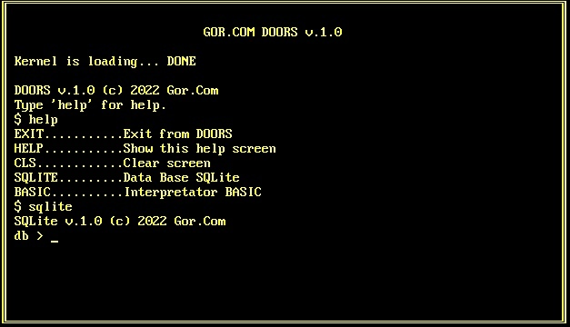
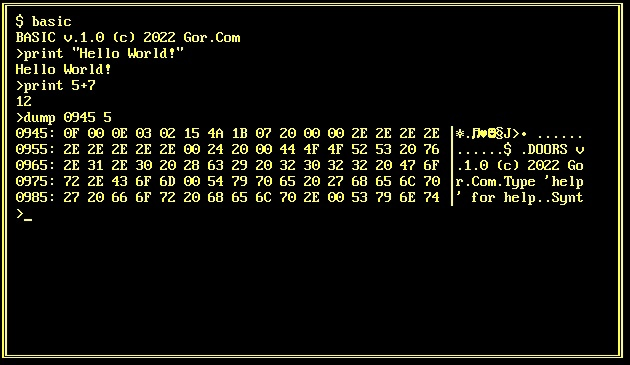
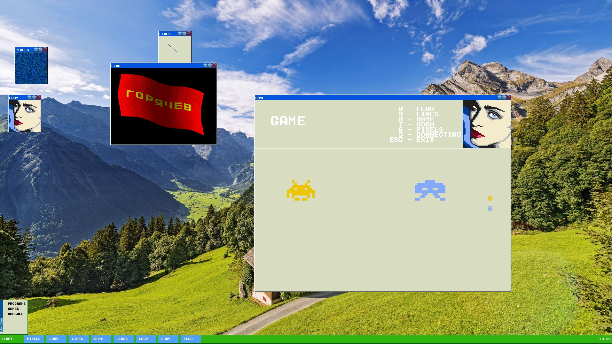

# Операционная система Doors 32-бит

  

Работает в 16-битном реальном режиме процессора x86, а также переключается в 32-битный защищенный режим.  
Видеорежимы: Текстовый (80x25) и Графический (VESA 1280х900).

Содержит:
- командный интерпретатор Shell
- интерпретатор Basic
- СУБД SQLite
- файловую систему FAT 16
- оконный графический интерфейс пользователя
- терминал через COM-порт
- системные вызовы через программные прерывания
- процессы и многозадачность, переключается по аппаратному прерыванию от таймера
- набор пользовательских утилит

Разрабатывается:
- стек сетевых протоколов TCP/IP

Написана на Ассемблере x86-64 и C.

Статус проекта: Разрабатывается.

## Лицензия

Copyright (c) 2022-2023 Evgeny Goryachev
Gor.Com 